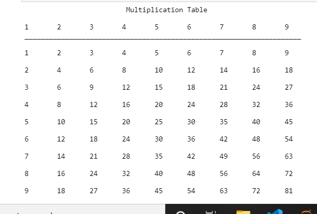

# PythonIsFun
## Simple fun Python projects
### multiplication.py
Creates a two dimensional array representing the multiplication table (1 - 9) on the terminal as shown below:         

### translator.py
Creates alanguage whereby vowels are translated to "ess" if lowercase or "ESS" IF UPPERCASE. Eg:
- Angel becomes ESSngessl
- Python becomes Pythessn
